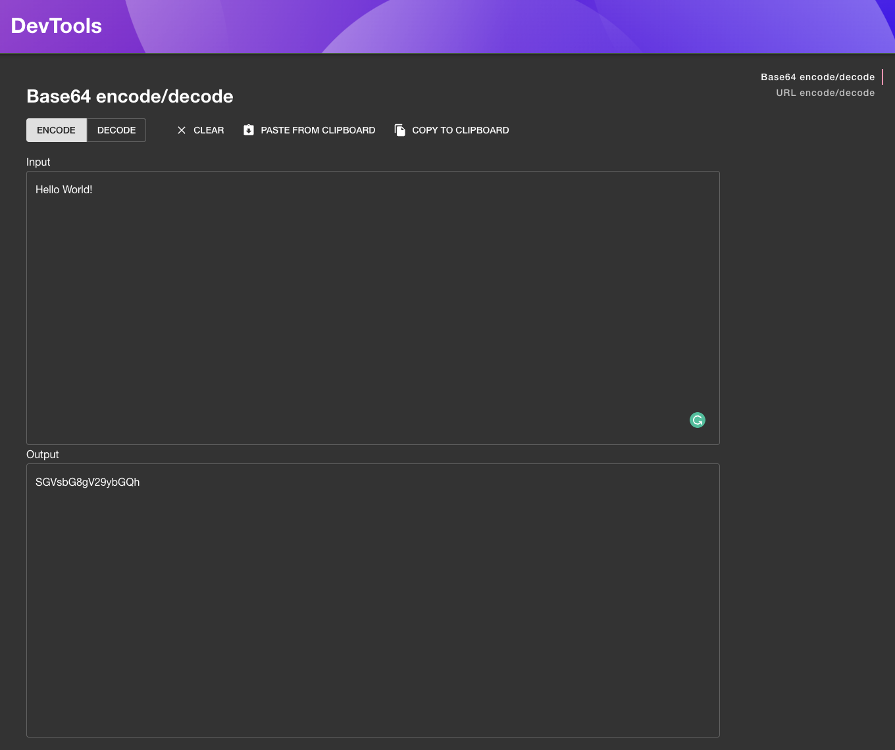

# backstage-plugin-toolbox

Backstage.io plugin for toolbox. This plugin provides frontend that allows developers to use development related
tools easily within backstage.

## Setup

Find [installation instructions](./docs/index.md#installation) in our documentation.

## Examples

