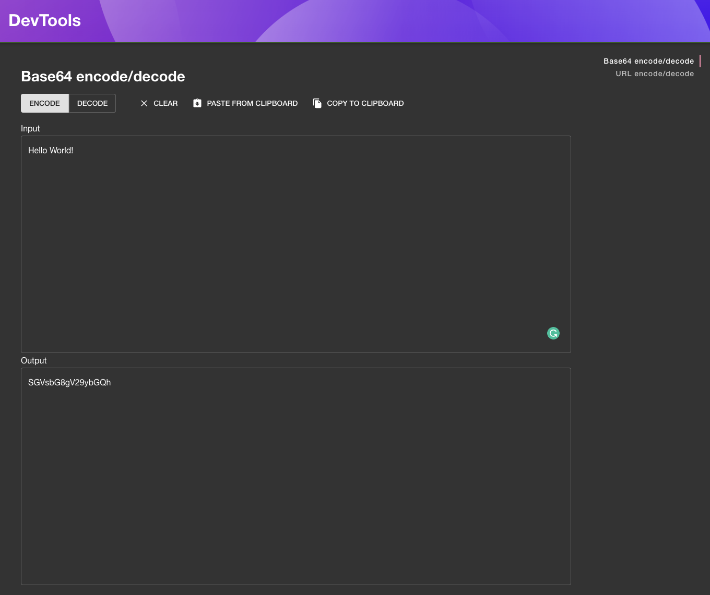

# backstage-plugin-toolbox

Backstage.io plugin for toolbox. This plugin provides frontend that allows developers to use development related
tools easily within backstage.

> **⚠️ Breaking change in v2.0.0**
>
> Version 2.0.0 drops support for the **legacy Backstage frontend system** (`createPlugin`, `ToolboxPage`, `ToolsContainer`, etc.).
> It now requires the **new Backstage frontend system** (`createFrontendPlugin`). If you are still using the legacy
> system, stay on v1.x or migrate your app to the new frontend system first.

## Setup

Find [installation instructions](./docs/index.md#installation) in our documentation.

## Examples

